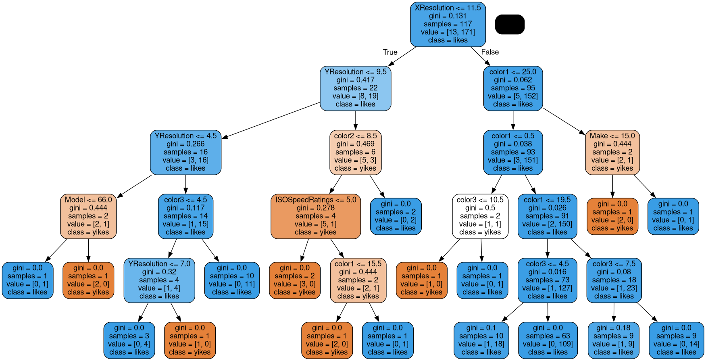
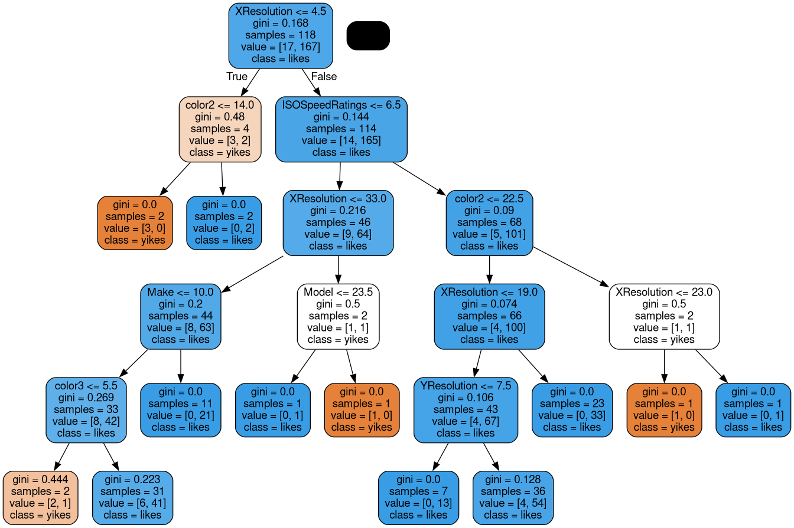
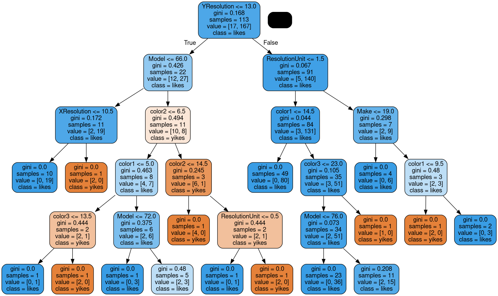

# QBIRS (Quite Basic Image Recommendation System)

This project uses simple Machine Learning algorythms to predict if a user will like or not a set of images according to the images he liked in the past. 

This project was made by `FAIN Thony` and `LONCHAMBON Alexis` as part of a Machine Learning project for the 8th semester of Computer Science Engineering at CPE Lyon. 

> ## Goal of the Project

This project aims to be able to predict a user's liking in images according to his past preferences.  
The code is relatively basic as this is a Proof of Concept and is far from being a reliable source of information : it is simply a small school project to allow us to learn Machine Learning through the python `sklearn` library.  

The provided `ipynb` file is a Jupyter Notebook allowing us to run each step of the program, from image download to prediction. To run the program with your own dataset follow the following steps : 

1. Place the images in the `img` folder
2. create a file at the root called `db.json` with the following format :
    ```json
    [
    {
        "name": "Image name",
        "img": "img/imagename.jpg",
        "width": 2800,
        "height": 1810,
        "orientation": "Paysage",
        "tags": {
            "ResolutionUnit": 2,
            "Make": "SONY",
            "Model": "DSLR-A200",
            "XResolution": "72.0",
            "YResolution": "72.0",
            "ISOSpeedRatings": 100
        }
    },
    ...
    ]
    ```
3. Run the `Install` part of the Jupyter Notebook
4. Run every cell from `Dominant Color Annotation` of the Jupyter Notebook  
    (if you already have a `db_images.json` file ready, run from `Open Color-Tagged database`)


> ## Data Sources

The preset data source is a WikiData query for the list of all planes with their images. 
There are a loarge number of planes in the world with varying types such as jet or propeller driven, military or civilian, etc... 

This allowed us to have a large dataset of around 500 images to train on. 

Unfortunately, half those images did not have exif tags in the images and most of the images that did, had outdated tags or very little description.   
Our objective (if we had time to do it) was to use AI image classification to tag our images to provide with a large dataset of tagged planes. Unfortunately again, we lacked the required time and funding to do so and we instead relied on the few exif tags and dominant colors tagging. 

All images used on wikimedia are under Public Domain or Creative Commons Share Alike

> ## Size of your data

As mentionned previously, the size of our data is around 500 images but only 250 are used as they have exif tags embedded.  
If AI Image Classification is used, the dataset could use all 500 images from the Wikidata query.  

As new images are added to the Wikidata database, the dataset is subject to changes in size and content.

Users are also allowed to use their own dataset as long as they follow the right steps described in the `Goal of the project` part of this report.

> ## Information Stored for each image

The image dataset is parsed and filtered to make new datasets ready for use. 

The first dataset `db.json` is made from the images downloaded from the Wikidata query. All available `Exif` tags are extracted as well as orientation, width and height of the image. In the exif tags, only `Make`, `Model`, `Resolution`, and `ISO` are used for now as they were the most logical to differentiate images. 

The second dataset `db_images.json` is made from processe versions of each imaged to add 3 dominant colors to the tags. Dominant colors are processed with `MiniBatchKmeans` algorythm and stored as RGB values. For the final prediction, we convert those RGB values to the colsest color name according to the `CSS3` standard.

> ## Information concerning user preferences

For user preferences, we only use whether or not the user liked an image.

> ## Machine Learning models used

To classify and tag the images we initially used `KMeans` algorythm and then switched to the lighter `MiniBatchKmeans`. It allowed us to correctly identify the dominant colors of each image of the dataset and create a database accordingly while still being fast enough (and using all core of the CPU). The number of dominant colors can be altered via the settings.

To predict the image likeliness to be liked, we used the `RandomForestClassifier` to be able to use a large amount of tags and use the color clusters easily.  
It trains on a provided set of data and builds n (here we use 10) decision trees with different values on a certain amount of levels (here we used 5 to get more accurate results). When provided with an input, each decision tree will vote for a result (here, we have only `likes` or `yikes`) and the most results wins.

Here are examples of trained Decision trees : 






> ## Self-evaluation

There is much to improve on this project. Performance can be greatly improved and data can be cleaned better.  
I wish we had time to use the AI classifier to have accurate tags instead of relying on exif data and color dominance.  

It is also notable to say that color dominance was not the best tag to use either as those images represents planes in the sky, where the sky or clouds tend to use lots of space in the image. 

The dataset format can be greatly improved for ease of use, as well as user interaction as for now, there is no real way to input user preference : for data purposes, liked images are randomly selected with a 0.1 chance of being liked. 

Work was not split evenly between devs as one of us had more experience and motivation than the other. Regardless, we both understood the different Machine Learning models and how Data Mining works. 

I also think more models could have been explored such as `DecisionTreeClassifier` to give a note on the image instead of a binary answer.  

> ## Conclusion

There is much to improve on this program and with enough time and dedication, it can actually work pretty accurately. 
